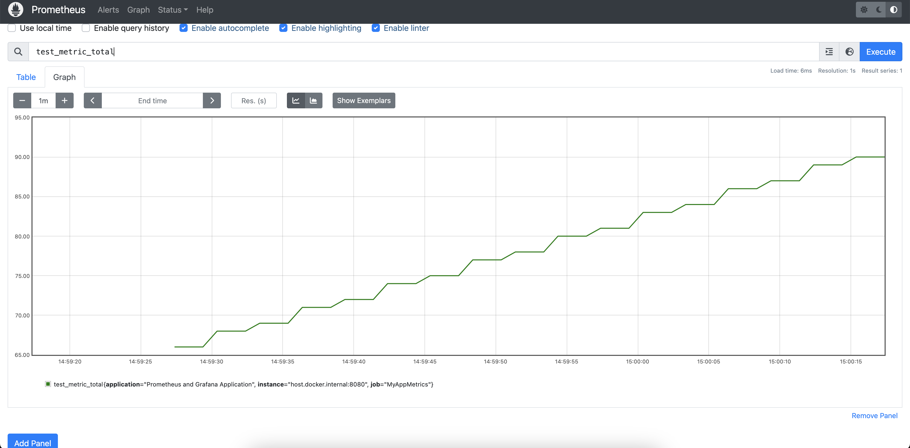
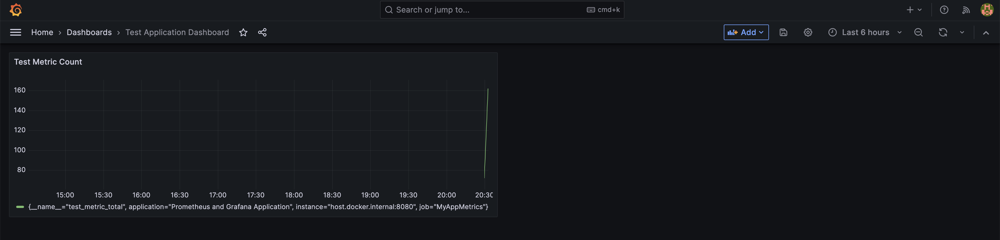

# Prometheus and Grafana

Medium Article Link - https://medium.com/simform-engineering/revolutionize-monitoring-empowering-spring-boot-applications-with-prometheus-and-grafana-e99c5c7248cf

## Build and Run

### Build

```shell
mvn clean install
```

### Run

```
mvn spring-boot:run
```

## Access `actuator` endpoint

Actuator endpoint is accessible at http://localhost:8080/actuator

## Access `prometheus` endpoint

Actuator endpoint is accessible at http://localhost:8080/actuator/prometheus

## Start Prometheus and Grafana Containers

Make sure that you have docker installed and it is up and running.

Open a new tab and run these commands. Make sure that your spring boot app is still up and running.

```shell
cd monitoring
```

```shell
docker-compose up
```

## Access Prometheus

Prometheus will be accessible at http://localhost:9090



## Access Grafana

Grafana will be accessible at http://localhost:3000

The default username and password are `admin` and `admin` respectively. You will be asked to change the password after your first login.

